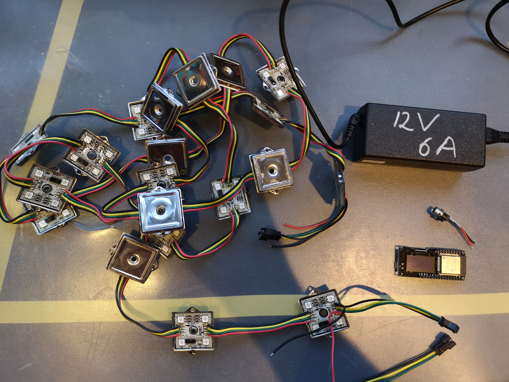
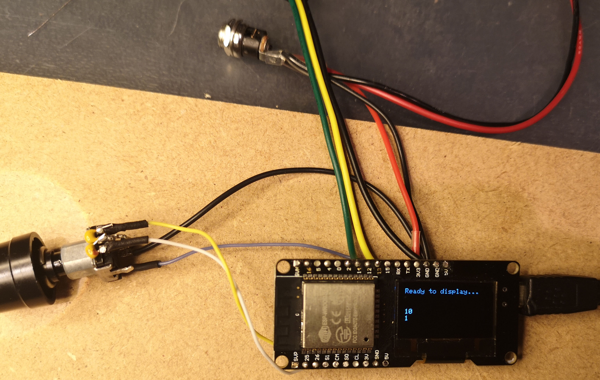
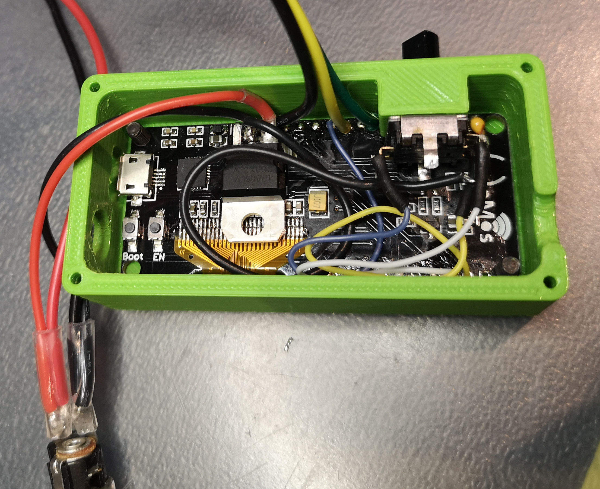
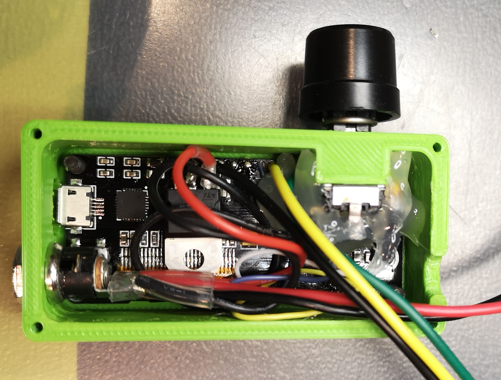
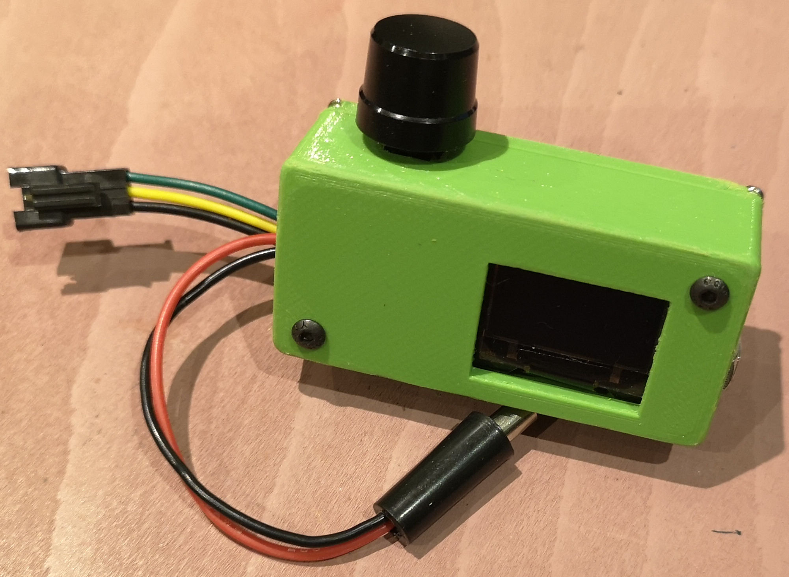
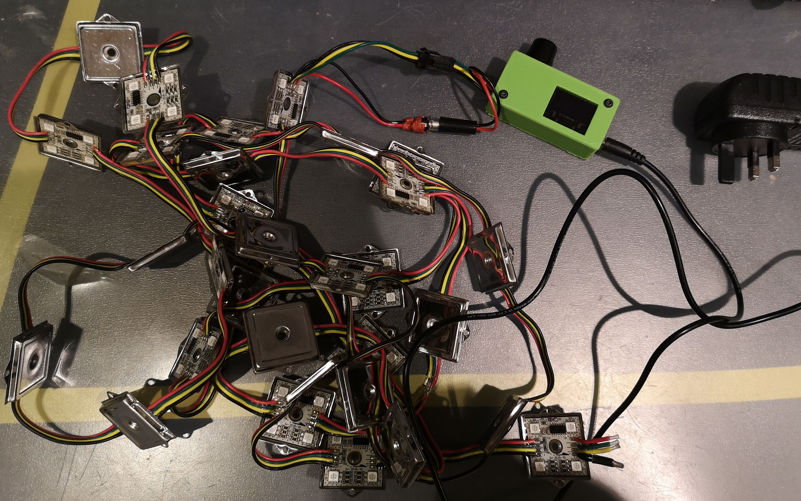
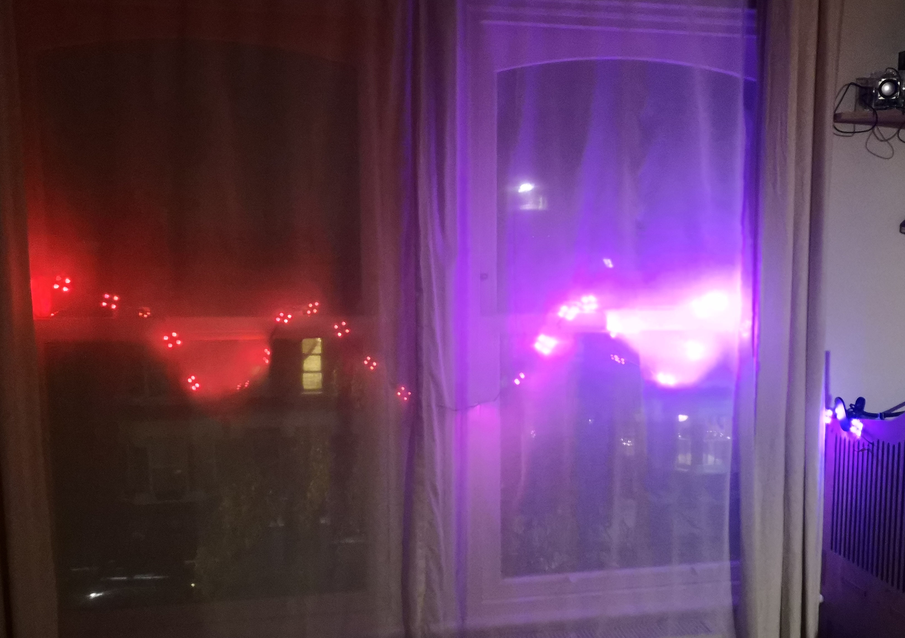

# christmas-lights

2 strips of WS2801 LEDs controlled by an ESP32 board with an integrated 128x64 I2C SSD1306 OLED display.

A rotary encoder is used to control the brightness of the LEDs and to change the "mode" (coloured/blinking lights / continuous white).

Powered by a simple 12V 3A wall wart.

Also using a 5V L4940V5 Linear Regulator to power the ESP32 board from the main 12V power line.

More details here: https://trandi.wordpress.com/2020/12/20/christmas-lights/

